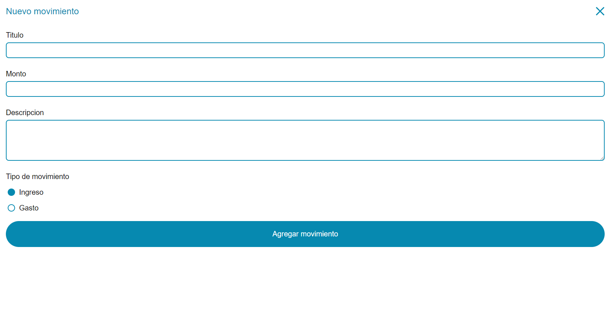

# CashFlow app
## Resume
Simple app where you can enter your cash movements build it in Vue.js.
Link to the deploy app: https://cashflowviewer.netlify.app/
## Images

## Commands

 - **npm run serve**: Run development server in localhost
 - **npm run lint**: Run linter in files
 - **npm run build**: Build the production version of the app
